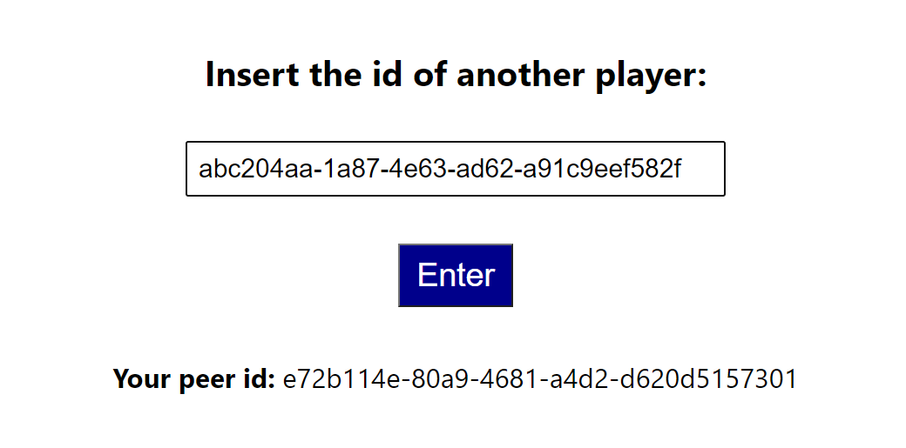
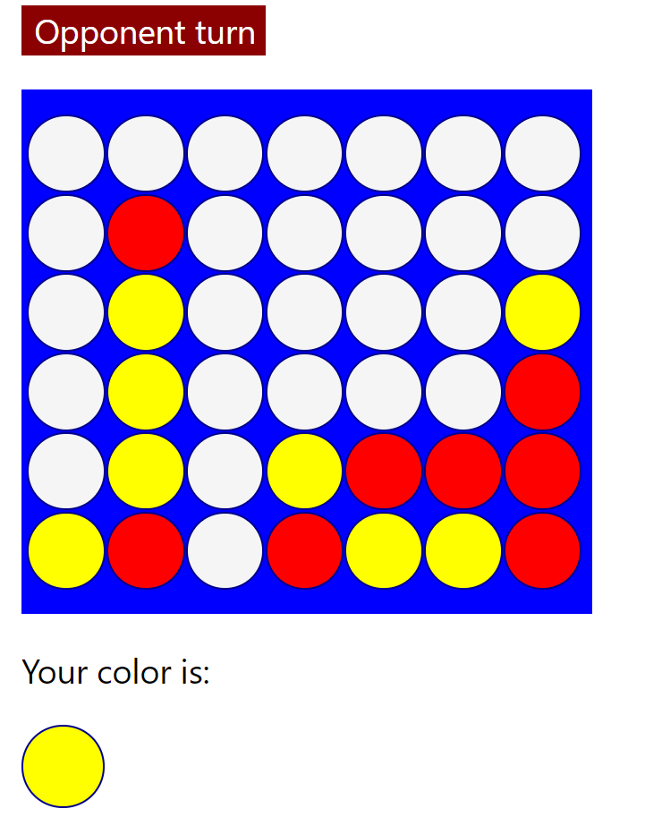
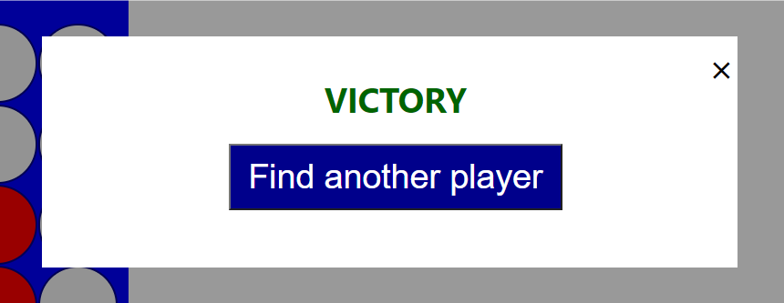

#  
# Forza 4

Progetto di Tecnologie Internet --- Luca Taverna - Giulia Oddi

## Panoramica del gioco

Il progetto, realizzato in JavaScript con il supporto del framework React, è una piattaforma web che permette ad alcuni utenti di giocare a Forza 4 in modalità peer-to-peer. \
La comunicazione peer-to-peer è stata gestita tramite la libreria PeerJs di JavaScript che permette di creare delle entità peer in grado di comunicare tra di loro. Infatti, il server è utilizzato solo per la creazione dei peer nel momento in cui essi si connettono al gioco e per mettere in comunicazione le due entità. \
Lo scambio di informazioni necessarie durante la partita avviene quindi direttamente tramite le due entità peer.

## Il gioco

Il gioco è una rappresentazione virtuale del classico gioco Forza 4 e quindi è stato realizzato tramite una griglia, rappresentata da una matrice di 6 righe x 7 colonne. \
Ogni giocatore deve avere la possibilità di inserire una sola pedina per ogni turno di gioco, dopodiché il turno passa al giocatore avversario. Per inserire una pedina il giocatore deve toccare sulla colonna desiderata e sarà il sistema a valutare e inserire la pedina nella prima cella libera dal basso. \
Per identificare e differenziare i due giocatori sono state scelte due pedine di colori differenti: il colore rosso è stato scelto per il peer che inizia la comunicazione e che quindi effettuerà la prima mossa nella partita, invece, al secondo peer è stato assegnato il colore giallo.  


Vince il primo utente che riesce a mettere in fila 4 pedine, che possono essere disposte in verticale, in orizzontale, oppure nelle diagonali. \
Il gioco può concludersi con la vittoria di un giocatore, oppure con un pareggio nel caso in cui tutte le celle risultino piene, ma senza la presenza di 4 pedine uguali in fila. \
Al termine del gioco viene chiesto ai peer se vogliono giocare un’altra partita, in tal caso entrambi
vengono reindirizzati alla pagina di connessione nella quale devono inserire l’id
dell’avversario.

## Avvio del gioco

Nella directory del progetto, si possono installare tutti i moduli necessari con:
```
npm install
```
Per avviare l'applicazione:

```
npm start
```

Aprendo [http://localhost:3000](http://localhost:3000) viene visualizzato il gioco nel browser.

## Interfaccia Utente
La prima schermata che viene mostrata all'utente che vuole giocare una partita è la seguente. 

<div style="display: flex;">
    
</div>

Cliccando sul tasto play, all'utente viene mostrato il proprio peer ID e gli viene chiesto se vuole inserire l'ID del proprio avversario. 

<div style="display: flex;">
    
</div>
<br>

Una volta collegati, ai due giocatori si aprirà la pagina di gioco vera e propria.

<div style="display: flex;">
    
    
</div>
<br>

Nel caso in cui si verifichi la vittoria o la sconfitta di un giocatore, questa verrà notificata tramite un popup.

<div style="display: flex;">
    
    
</div>
<br>

Nel caso in cui tutta la griglia venga riempita senza la vittoria di uno dei due giocatori, verrà mostrato un popup di pareggio della partita.


<div style="display: flex;">
    
</div>
<br>

&Eacute; stata anche gestita la disconnessione di uno dei due giocatori. \
Nel caso accada che un utente si disconnetta infatti, all'altro giocatore verrà notificato tale evento, e gli verrà chiesto se vuole cercare un nuovo avversario.

<div style="display: flex;">
    
</div>
<br>
